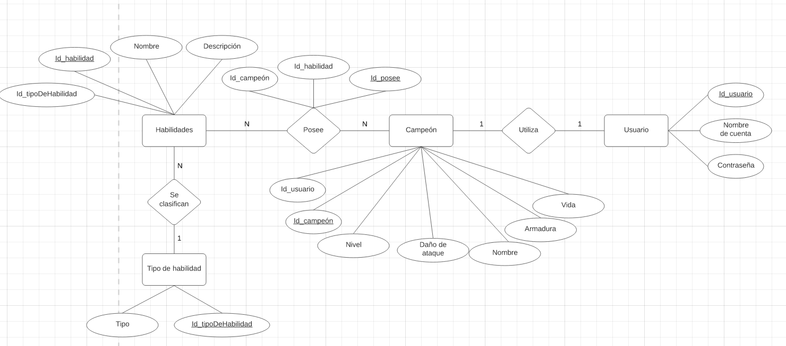

# CampeonesVideojuego(PHP & MySQL)

## ÍNDEX CONTENIDO

**IDE**: Visual Studio Code

**Lenguajes**: HTML, PHP

**Base de Datos**: MySQL

**Resumen**: Esta es una página web en la cual podremos experimentar que un Usuario utiliza un Campeón y viceversa. Un campeón posee muchas habilidades que comparte con otros campeones. Estas habilidades pueden ser de un solo tipo.

**Usuario**: robert
**Contraseña**: 123

**DIAGRAMA ENTIDAD RELACIÓN**

**MODELO RELACIONAL**
- **Campeón** ( id_campeon, id_usuario,nivel,ataque,armadura,vida, nombre).
Donde ,id_usuario,és llave forana de Campeón.
- **Usuario** (id_usuario, nombre_cuenta,contrasenya).
- **Posee** ( id_posee, id_habilidad, id_campeón).
Donde id_habilidad és llave forana de Habilidades.
Donde id_campeón és llave forana de Campeón.
- **Habilidades** ( id_habilidad,nombre,descripción,id_tipo_habilidad).
Donde id_tipo_habilidad és llave forana de Habilidad.
- **Tipo_habilidad** (id_tipoDeHabilidad, tipo).
